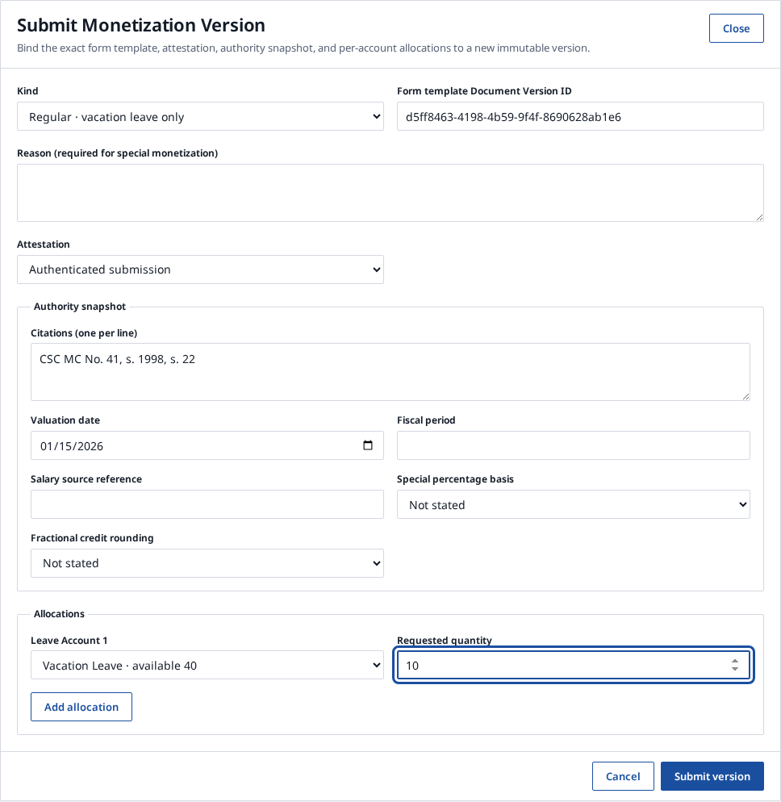
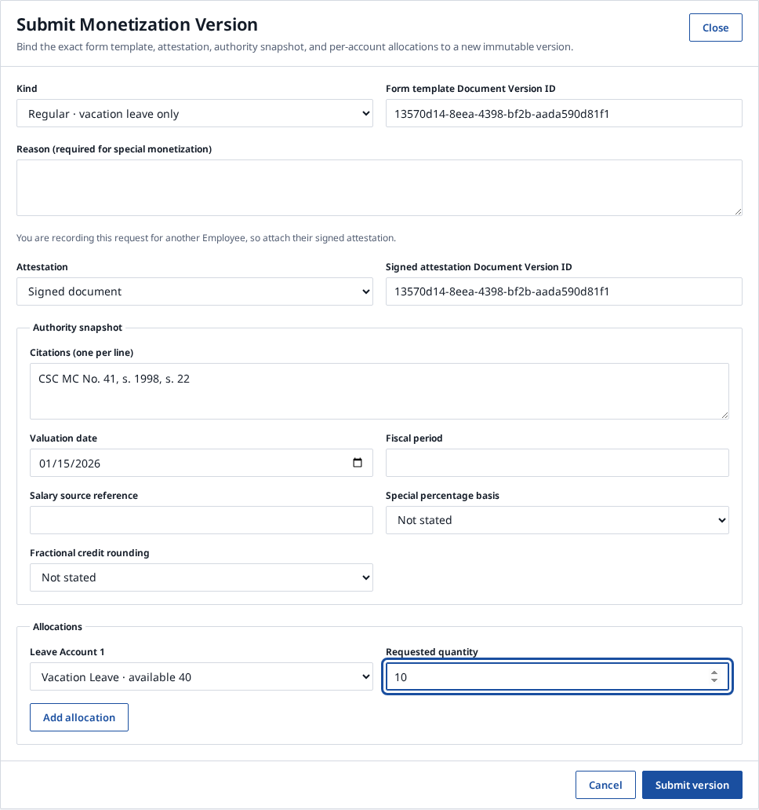
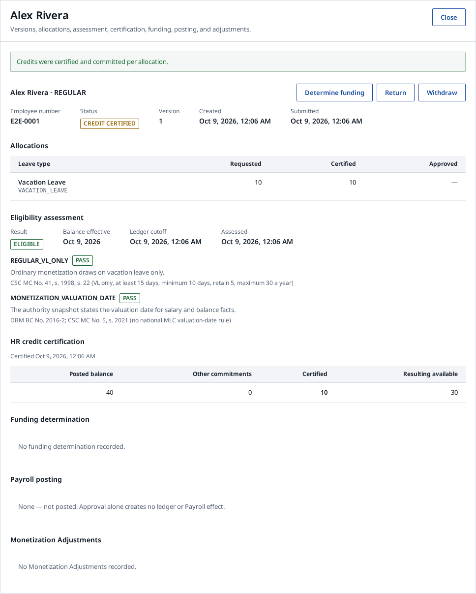
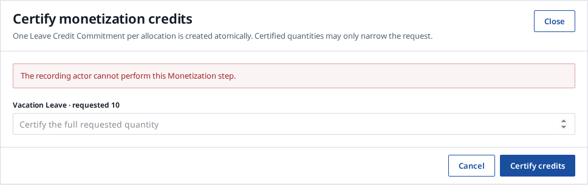

**Title:** `fix(leave-monetization): require the subject Employee for authenticated attestation`

## Summary
An authenticated submission now counts as an Employee's attestation only when
that Employee makes it. Anyone who records a request for another Employee must
attach the exact signed Document Version. Credit certification also refuses the
person who recorded or submitted the request.

## Why
Before this change, an Agency recorder could submit another Employee's
monetization request as `AUTHENTICATED_SUBMISSION`. The record then claimed an
Employee attestation the Employee never made. The same recorder could also
certify the credits for the request they had entered themselves.

## Changes
**API: `leave-monetization.service.ts`**
- `submit`: refuses `AUTHENTICATED_SUBMISSION` with
  `MONETIZATION_ATTESTATION_FORBIDDEN` (403) when the actor's Employee is not
  the subject. The check runs before the idempotent replay, so a stored result
  can't be replayed past it.
- `certify`: calls `assertActorSeparation` with `prohibitSubmitter` and the new
  `prohibitRecorder`. The recorder message is "The recording actor cannot
  perform this Monetization step."
- `list`: `MonetizationPage` gains `actorEmployeeId: string | null`. This is an
  additive change.
- Adds an `actorEmployeeId(transaction, context)` helper and uses it for the
  existing subject check.

**Web: `leave-monetization-workspace.tsx`**
- When the viewer is not the subject, the Attestation select offers only
  "Signed document", selects it by default, and shows a short hint.

## Before and After

The same recorder records a request for another Employee (Alex Rivera,
E2E-0001). These screenshots come from the phase-7 Playwright test, run at the
base commit `0552576` and at the head commit `fb23f20`.

**Submit dialog**
- **Before:** "Authenticated submission" is selected, even though the viewer is
  not the Employee.
- **After:** a hint explains why a signed attestation is needed. Only "Signed
  document" is offered, and the Document Version field appears.

| Before | After |
| --- | --- |
|  |  |

**Certify credits**
- **Before:** the recorder certifies their own entry, and the request becomes
  `CREDIT CERTIFIED`.
- **After:** certification is refused, and the request stays `SUBMITTED`.

| Before | After |
| --- | --- |
|  |  |

## Validation
All checks ran on the head commit `fb23f20` against a local PostgreSQL database.

| Check | Command | Result |
| --- | --- | --- |
| Format | `pnpm exec prettier --check` on the 4 changed files | Pass |
| Lint | `turbo run lint --filter=@lingkod-hr/api --filter=@lingkod-hr/web` | Pass |
| Typecheck | `turbo run typecheck --filter=@lingkod-hr/api --filter=@lingkod-hr/web` | Pass |
| Integration (DB) | `pnpm test:db --filter @lingkod-hr/api -- src/leave-monetization/leave-monetization.integration.test.ts` | Pass: 1 file, 1 test |
| E2E | `playwright test e2e/phase-7-leave-monetization.spec.ts` | Pass at both base and head |

For the E2E run, two `page.screenshot` lines were added temporarily to capture
the images above. They are not part of this PR.

The full `pnpm validate` was not run, so tests outside these files are
unchecked.

## Risk
- Clients that send `AUTHENTICATED_SUBMISSION` on someone else's behalf now get
  a 403.
- The E2E test now stops at certification. Funding-step actor separation is no
  longer exercised in the browser.

Refs #460

Model: Claude Opus 5.5
